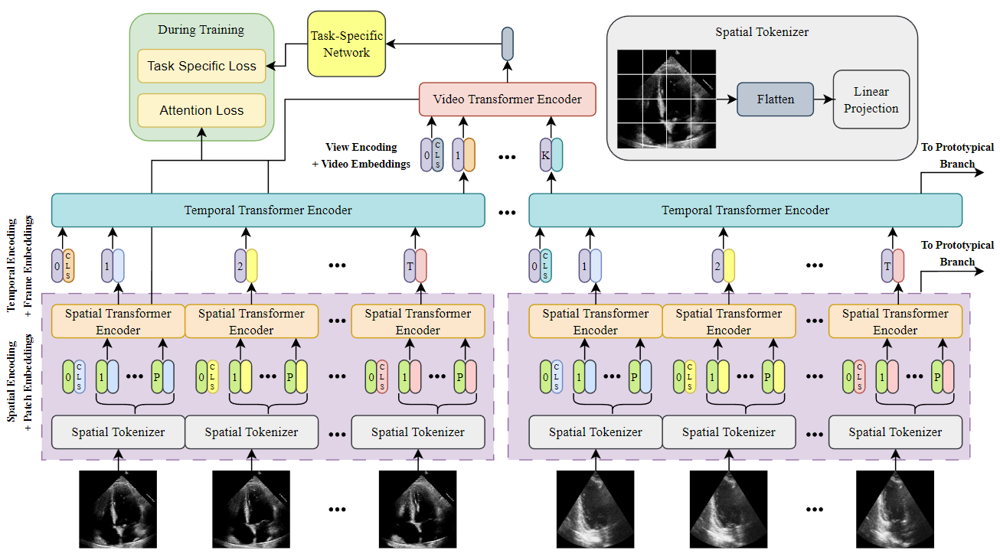

# GEMTrans: A General, Echocardiography-based, Multi-Level Transformer Framework for Cardiovascular Diagnosis

This repository provides the official PyTorch implementation of:

Masoud Mokhtari, Neda Ahmadi, Teresa Tsang, Purang Abolmaesumi, and Renjie Liao, [GEMTrans: A General, Echocardiography-based, Multi-Level Transformer Framework for Cardiovascular Diagnosis](Linktobeadded) (MICCAI 2023)

## Abstract
Echocardiography (echo) is an ultrasound imaging modality that is widely used for various cardiovascular diagnosis tasks.  Due to inter-observer variability in echo-based diagnosis, which arises from the variability in echo image acquisition and the interpretation of echo images based on clinical experience, vision-based machine learning (ML) methods have gained popularity to act as secondary layers of verification. For such safety-critical applications, it is essential for any proposed ML method to present a level of explainability along with good accuracy. In addition, such methods must be able to process several echo videos obtained from various heart views and the interactions among them to properly produce predictions for a variety of cardiovascular measurements or interpretation tasks. Prior work lacks explainability or is limited in scope by focusing on a single cardiovascular task. To remedy this, we propose a **G**eneral, **E**cho-based, **M**ulti-Level **T**ransformer (GEMTrans) framework that provides explainability, while simultaneously enabling multi-video training where the inter-play among echo image patches in the same frame, all frames in the same video, and inter-video relationships are captured based on a downstream task. We show the flexibility of our framework by considering two critical tasks including ejection fraction (EF) and aortic stenosis (AS) severity detection. Our model achieves mean absolute errors of 4.15 and 4.84 for single and dual-video EF estimation and an accuracy of 96.5 % for AS detection, while providing informative task-specific attention maps and prototypical explainability.

<p align="center">

</p>

## Requirements

PyTorch must be separately installed based on your system requirements. In our implementation, we used the following:

```
pip install torch==1.12.1+cu113 torchvision==0.13.1+cu113 torchaudio==0.12.1 --extra-index-url https://download.pytorch.org/whl/cu113
```

To install the rest of the requirements (preferably in a virtual environment), run:
```
pip install -r requirements.txt
```

## Dataset

We use the EchoNet-Dynamic public EF dataset in this project. Access it [here](https://echonet.github.io/dynamic/index.html). Download the dataset to a convenient location and provide its directory in the config file as described in [Config File](#config-file).

## Training

To train the model (training + validation), create a training configuration yaml file similar to `/configs/default.yml`. Modify the config file as needed, consulting [Config File](#config-file). To start with a pretrained version of the ViT for the STE, download The `B_16.pth` variant from https://github.com/lukemelas/PyTorch-Pretrained-ViT/releases/tag/0.0.2 and specify the path to this file under `model.pretrained_patch_encoder_path` in the config file.
Then, run:

```
python run.py --config_path <path_to_training_config> --save_dir <dir_to_save_ouput_to>
```

## Evaluation

To evaluate an already trained model, create a training configuration yaml file similar to `/configs/default.yml` that matches the trained model's specifications. Provide the path to the trained model using the `model.checkpoint_path` option in the config file. Finally, run:


```
python run.py --config_path <path_to_training_config> --save_dir <dir_to_save_ouput_to> --test
```

## Config File

The default configuration can be found in `./configs/default.yml`. Below is a summary of some important configuration options:

- **train**
  - *mode*: Determines whether the model is used for EF estimation (regression) or AS severity classification.
  - *criteria*
    - *attn_lambda*: Weight for the spatial attention supervision loss
    - *frame_lambda*: Weight for the temporal attention supervision loss
    - *classification_lambda*: Weight for additional classification loss for a regression task (binning different output ranges into classes)
  - *optimizer*
    - *add_on_layers_lr*: (Only used for prototypical training) To be added by Neda
    - *prototype_vectors_lr*: (Only used for prototypical training) To be added by Neda
    - *last_layer_lr*: (Only used for prototypical training) To be added by Neda
  - *evaluator*
    - *standards*: Evaluation metrics computed for the model
    - *eval_metric*: Metric used to decide when the best model checkpoint is saved (among the standards)
    - *maximize*: Determines whether the eval_metric is to be maximized or minimized
- **model**
  - *checkpoint_path*: Path to the saved model for inference or continued training
  - *<>_num_layers*: Number of transformer layers
  - *<>_num_heads*: Number of attention heads for each transformer layer
  - *<>_mlp_dim*: Dimension of the MLP used inside the transformer encoder
  - *<>_aggr_method*: Aggregation method used to obtain a single representation from the local tokens
  - *<>_hidden_dim*: Hidden dimension of the transformer encoder layers
  - *pretrained_patch_encoder_path*: Path to the ImageNet-pretrained weights of the ViT used for the spatial transformer encoder. The `B_16.pth` variant can be downloaded from https://github.com/lukemelas/PyTorch-Pretrained-ViT/releases/tag/0.0.2.
  - *use_ppnet*: (Only used for prototypical training) Set to True for prototypical training
- **data**
  - *name*: Dataset name
  - *dataset_path*: Path to the dataset
  - *max_frames*: Maximum number of frames per clip
  - *n_sampled_frames*: Number of samples to sample from a clip
  - *max_clips*: Maximum number of clips to extract for a video during inference

